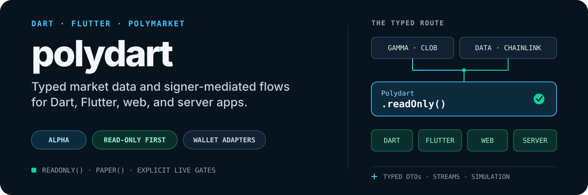
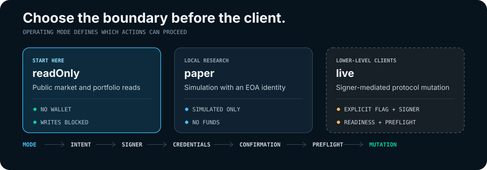

<p align="center">
  
</p>

<p align="center">
  <a href="#quick-start">Quick start</a> ·
  <a href="#use-it-from-flutter">Flutter</a> ·
  <a href="#operating-modes">Modes</a> ·
  <a href="#safety-boundary">Safety</a> ·
  <a href="capabilities.json">Capability catalog</a>
</p>

**Polydart is a Dart-native Polymarket SDK.** It provides typed access to public
Gamma, CLOB, Data API, WebSocket, and Chainlink surfaces, plus paper-mode and
explicitly gated signer-mediated protocol building blocks.

> [!IMPORTANT]
> Polydart is alpha-ready, not stable or production-live ready. APIs may change.
> Start with `Polydart.readOnly()`; live mutations use lower-level clients and
> require explicit mode, signer, credential, confirmation, and preflight gates.

## What you get

- **Market discovery** — Gamma search, markets, events, profiles, tags, curated categories, and market resolution. [`lib/src/gamma`](lib/src/gamma) · [`lib/src/marketresolver`](lib/src/marketresolver)
- **Prices and streams** — CLOB books, prices, spreads, trades, metadata, and typed market WebSockets. [`lib/src/clob`](lib/src/clob) · [`lib/src/stream`](lib/src/stream)
- **Portfolio intelligence** — Positions, activity, holders, open interest, leaderboards, and read-only wallet analysis. [`lib/src/dataapi`](lib/src/dataapi) · [`lib/src/intel`](lib/src/intel)
- **Cross-platform data** — Polygon Chainlink USD feeds and plain-Dart clients for Flutter, web, CLI, and server apps. [`lib/src/chainlink`](lib/src/chainlink)
- **Research and protocol tools** — Paper state, order-book simulation, typed signers, readiness checks, settlement planning, and guarded mutation paths.

The machine-readable [capability catalog](capabilities.json) records each
operation's tier, auth, signing, mutation status, implementation state, and
tests.

## Quick start

Add the published alpha:

```yaml
dependencies:
  polydart: ^0.1.0-alpha.2
```

Then read public market data without a wallet or credentials:

```dart
import 'package:polydart/polydart.dart';

Future<void> main() async {
  final client = Polydart.readOnly();
  try {
    final search = await client.gamma.search(
      const SearchParams(query: 'btc', limitPerType: 3),
    );

    final event = search.events.isEmpty ? null : search.events.first;
    final market = event?.markets.isNotEmpty ?? false
        ? event!.markets.first
        : null;
    if (market == null) return;

    final resolved = await client.resolver.resolveBySlug(market.slug);
    final tokenId = resolved?.tokenIds.isEmpty ?? true
        ? null
        : resolved!.tokenIds.first;
    if (tokenId == null) return;

    print('${market.question}: ${await client.clob.midpoint(tokenId)}');
  } finally {
    client.close();
  }
}
```

Run the bundled end-to-end read example:

```sh
dart pub get
dart run example/read_only.dart
```

To pin the repository instead of pub.dev, use the release tag:

```yaml
dependencies:
  polydart:
    git:
      url: https://github.com/TrebuchetDynamics/polydart.git
      ref: v0.1.0-alpha.2
```

## Use it from Flutter

Polydart is plain Dart: it has no Flutter dependency, and its WebSocket transport
selects the appropriate VM or browser adapter. Your app owns state management,
wallet UX, storage, confirmations, and client disposal.

| Goal | Start here | Boundary |
| --- | --- | --- |
| Read markets in a Flutter repository | [`example/flutter_read_only.dart`](example/flutter_read_only.dart) | No wallet or credentials |
| Integrate app lifecycle and platform behavior | [Flutter readiness](docs/FLUTTER-APP-READINESS.md) | App owns `client.close()` and stream cleanup |
| Adapt Reown / WalletConnect signing | [`example/flutter_wallet_signer.dart`](example/flutter_wallet_signer.dart) | App-owned `WalletSigner`; no embedded keys |
| Exercise deposit-wallet signing | [`example/flutter_deposit_wallet_order.dart`](example/flutter_deposit_wallet_order.dart) | Mock-only; no funds or live submission |

Flutter Web can use public HTTP and WebSocket reads, subject to normal browser
CORS and CSP rules. SIWE cookie login and Relayer V2 credential minting require
a VM/mobile/desktop flow or an app-owned backend boundary.

## Operating modes

<p align="center">
  
</p>

- **`Polydart.readOnly()`** — public reads; no wallet; writes blocked.
- **`Polydart.paper(eoaAddress: ...)`** — local simulation with an identity; no live funds.
- **Lower-level live clients** — explicit live mode and flag, app-owned signer,
  credentials, confirmation, readiness checks, and preflight.

## Safety boundary

- Normal Flutter, mobile, and web apps should adapt Reown, WalletConnect, or an
  equivalent wallet provider through `WalletSigner`.
- Never store raw private keys, seed phrases, or funded wallet secrets in app
  code, examples, assets, or logs.
- `LocalEoaSigner` is an explicit tool for tests, headless/server automation,
  alpha experiments, and paper trials—not the default app custody path.
- Generated paper wallets must never be promoted into live custody.
- Trading, approvals, transfers, deployment, and settlement remain explicit,
  test-covered mutation paths. The app must preserve user intent and confirmation.

> [!CAUTION]
> Simulation and signing previews do not submit orders or prove live readiness.
> Real execution can differ because of fees, latency, liquidity, slippage, and
> market movement.

## Capability taxonomy

[`capabilities.json`](capabilities.json) shares operation IDs and status semantics
with [Polyrover](https://github.com/TrebuchetDynamics/polyrover), using
Polymarket CLI commit `9b18b5f` as a read-only naming reference. Statuses are
`implemented`, `dtoOnly`, `unsupported`, and `planned`.

Taxonomy parity does not imply implementation parity. For authenticated,
signing, wallet, and execution behavior, Polygolem remains Polydart's protocol
reference.

<details>
<summary><strong>For contributors: twin parity with Polygolem</strong></summary>

Polydart mirrors Polygolem's public protocol surfaces, request shapes, fixtures,
safety semantics, and user-facing capabilities while keeping Dart-native package
and wallet boundaries. Before protocol work, refresh a local read-only Polygolem
reference checkout and record the commit used in parity tests and docs.

```sh
if [ -d polygolem/.git ]; then
  git -C polygolem pull --ff-only origin main
else
  git clone https://github.com/TrebuchetDynamics/polygolem.git polygolem
fi
```

Do not implement signing, relayer, wallet, or live CLOB behavior from memory or
stale documentation. See the [coverage matrix](docs/POLYDART-POLYGOLEM-COVERAGE.md)
and [parity matrix](docs/POLYDART-POLYGOLEM-PARITY.md).

</details>

## Build and verify

```sh
dart pub get
dart format --output=none --set-exit-if-changed .
dart analyze
dart test
```

Tests use local fixtures and mocks unless a network test is explicitly enabled.

## Documentation

- [End-user guide](docs/END-USER-GUIDE.md)
- [Flutter app readiness](docs/FLUTTER-APP-READINESS.md)
- [Deposit-wallet readiness checklist](docs/DEPOSIT-WALLET-READINESS-CHECKLIST.md)
- [Random private-key smart-wallet E2E](docs/RANDOM-PRIVATE-KEY-SMART-WALLET-E2E.md)
- [Changelog](CHANGELOG.md)
- [Product requirements](docs/PRD.md) · [Implementation plan](docs/PLAN.md)

## License

Licensed under the [MIT License](LICENSE).
